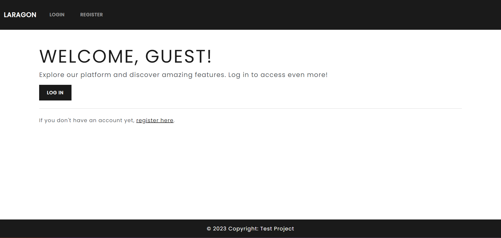

# Laravel Sentry Authentication App with CRUD

This is a Laravel application that implements Sentry authentication and CRUD (Create, Read, Update, Delete) functionality.

## Features

- User registration and login using Sentry authentication.
- CRUD operations for managing resources.

## Installation

1. Clone the repository:

    ```bash
    git clone https://github.com/juswaa101/LaravelSentry.git
    ```

2. Install the dependencies:

    ```bash
    composer install
    ```

3. Configure the environment variables:

    ```bash
    cp .env.example .env
    php artisan key:generate
    ```

    Update the `.env` file with your database credentials.

4. Migrate the database:

    ```bash
    php artisan migrate
    ```

5. Seed the database:

    ```bash
    php artisan db:seed
    ```

    This command will populate the database with sample data using the seeders.

6. Set up the email provider:

    To catch email notifications, you need to configure an email provider. Update the following variables in the `.env` file with your email provider's credentials:

    ```plaintext
    MAIL_MAILER=smtp
    MAIL_HOST=your-email-host
    MAIL_PORT=your-email-port
    MAIL_USERNAME=your-email-username
    MAIL_PASSWORD=your-email-password
    MAIL_ENCRYPTION=your-email-encryption
    MAIL_FROM_ADDRESS=your-email-from-address
    MAIL_FROM_NAME="${APP_NAME}"
    ```

    Replace `your-email-host`, `your-email-port`, `your-email-username`, `your-email-password`, `your-email-encryption`, and `your-email-from-address` with the appropriate values for your email provider.

7. Set up the queue driver:

    By default, Laravel uses the `sync` queue driver, which executes jobs immediately. If you want to use a different queue driver, such as `database` or `redis`, update the `QUEUE_CONNECTION` variable in the `.env` file.

8. Run the queue jobs:

    To process queued jobs, run the following command:

    ```bash
    php artisan queue:work
    ```

    ```bash
    php artisan queue:listen
    ```

    This command will start a worker process that listens for new jobs and processes them in the background. Make sure to keep this command running in a separate terminal window or as a background process.

9. Start the development server:

    ```bash
    php artisan serve
    ```

10. Open your browser and visit `http://{{APP_URL}}` to access the application.


*Landing Page*

## Usage

- Register a new user account.
- Log in with your credentials.
- Email Verification
- Forgot Password
- Perform CRUD operations on the resources.

## Contributing

Contributions are welcome! If you find any issues or have suggestions, please open an issue or submit a pull request.

## License

This project is licensed under the [MIT License](LICENSE).
